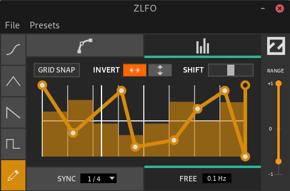

ZLFO
====

ZLFO is a fully featured LFO for CV-based
automation.

It comes as a cross-platform LV2 plugin bundle
with a custom UI.

ZLFO is written in C and uses
[ZToolkit](https://git.zrythm.org/cgit/ztoolkit/)
for its UI.

Thanks to Mire for the design.

Dependencies
------------

Cairo, ztoolkit, glib, X11 and librsvg.

Building
--------

    meson build
    ninja -C build
    ninja -C build install

License
-------
ZLFO is free software: you can redistribute it and/or modify
it under the terms of the GNU Affero General Public License as
published by the Free Software Foundation, either version 3 of the
License, or (at your option) any later version.

ZLFO is distributed in the hope that it will be useful,
but WITHOUT ANY WARRANTY; without even the implied warranty of
MERCHANTABILITY or FITNESS FOR A PARTICULAR PURPOSE.  See the
GNU Affero General Public License for more details.

The full text of the license can be found in the
[COPYING](COPYING) file.

For the copyright years, ZLFO uses a range (“2008-2010”) instead of
listing individual years (“2008, 2009, 2010”) if and only if every year
in the range, inclusive, is a “copyrightable” year that would be listed
individually.

Some files, where specified, are licensed under
different licenses.

----

Copyright (C) 2020 Alexandros Theodotou

Copying and distribution of this file, with or without modification,
are permitted in any medium without royalty provided the copyright
notice and this notice are preserved.  This file is offered as-is,
without any warranty.
