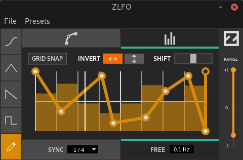

ZLFO
====

ZLFO is a fully featured LFO for CV-based
automation.

It comes as a cross-platform LV2 plugin bundle
with a custom UI.

ZLFO is written in C and uses
[ZToolkit](https://git.zrythm.org/cgit/ztoolkit/)
for its UI.

Thanks to Mire for the design.

----

Copyright (C) 2020 Alexandros Theodotou

Copying and distribution of this file, with or without modification,
are permitted in any medium without royalty provided the copyright
notice and this notice are preserved.  This file is offered as-is,
without any warranty.
